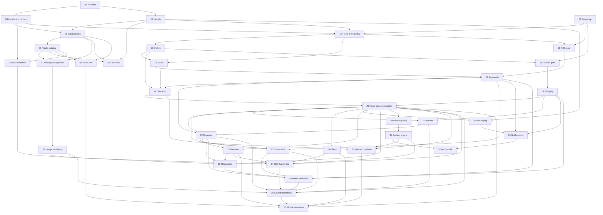

# RISHIT Roadmap

This is the authoritative source for numbered task scope, dependencies, status, and external blockers. Product-level sequencing in [MVP.md](MVP.md) remains useful context; when it conflicts with this file, this file controls task execution.

Status snapshot: 2026-08-11. Task 01 was merged in `master` commit `f7f7705`. Tasks 02–10 were verified in `master` commit `43aa21b`; they are not missing work.

## Status rules and next action

- `BLOCKED`: a dependency is not `DONE`, or a named external decision/evidence item is open.
- `READY`: every dependency is `DONE` and no external blocker prevents safe work.
- `RUNNING`: implementation is active in its numbered task branch.
- `REVIEW`: its pull request is ready but not merged; dependants must still wait.
- `DONE`: verified work is merged into `master`.

Task 01 is `DONE`. **Task 11 — Production image hardening** is the single recommended next implementation task and is `READY` on its implemented dependencies. External legal/provider evidence work may proceed without changing blocked implementation tasks to `READY`.

## Decision register

| ID | State | Decision and effect |
| --- | --- | --- |
| D-01 | Confirmed | Checked-in product documentation is authoritative. Older attached planning prompts remain historical context but are superseded where they conflict with this register, [PRODUCT.md](PRODUCT.md), or [BUSINESS-RULES.md](BUSINESS-RULES.md). |
| D-02 | Confirmed | Public customer UI supports Albanian (`sq`) and English (`en`). User-authored content is preserved in its original language. |
| D-03 | Confirmed | New public listings and marketplace transactions use EUR only, stored as integer cents with explicit currency. Older requirements for ALL are superseded. Existing ALL support/records are legacy context only: preserve and exclude them from public discovery; do not relabel or convert them without an approved migration policy. |
| D-04 | Confirmed | Seller listing fee is EUR 0 and seller selling fee is EUR 0. Buyer-side fees, including any Buyer Protection charge, are unresolved and must not be invented. |
| D-05 | Confirmed | RISHIT is a transactional C2C marketplace, not an off-platform classifieds flow. Payment, escrow/custody, settlement, protection, courier, return, and dispute claims require matching provider, policy, and legal evidence. |
| D-06 | Confirmed | Keep the modular Laravel monolith, Blade-rendered essential public content, and versioned `/api/v1`; web and API controllers reuse application/domain rules. |
| D-07 | Confirmed | A listing is one unique physical item. Purchase, reservation, bidding, and auction closure require server-authoritative transactions, constraints, row locks, idempotency, and concurrency tests. |
| D-08 | Confirmed | Vinted is a UX and product-flow reference only. RISHIT uses original text, code, assets, photography, trademarks, and visual identity. |

## Tasks 01–36

Blocker IDs refer to the external blocker register below. Acceptance criteria describe the smallest durable outcome for each task.

| Task | Outcome | Depends on | Status | Concise acceptance criteria | External blockers |
| --- | --- | --- | --- | --- | --- |
| 01 | Decision register and executable roadmap | — | DONE | One authoritative Tasks 01–36 register reflects implemented work, dependencies, decisions, blockers, and graph; related docs agree; no application behavior changes. | — |
| 02 | Laravel and local runtime foundation | — | DONE | Laravel 13/PHP 8.5 app, locked dependencies, Docker Compose MySQL/Redis services, environment template, setup and verification commands exist. | — |
| 03 | Localization and money foundation | 02 | DONE | `sq`/`en` routing and translations work; EUR money uses integer cents and explicit currency; legacy ALL display remains identifiable and private from public discovery. | — |
| 04 | Identity and security baseline | 02 | DONE | One buyer/seller identity supports registration, login/logout, hashed passwords, session regeneration, throttling, unique credentials, and Sanctum-ready users. | — |
| 05 | Catalog data foundation | 03, 04 | DONE | Categories, brands, unique-item listings, ordered images, favorites, factories, and deterministic seed data exist with explicit status/currency fields. | — |
| 06 | Public SSR catalog and profiles | 05 | DONE | Blade renders home, catalog, listing, and seller pages; active EUR inventory supports shared search/filter/sort without JavaScript. | — |
| 07 | Seller listing and photo management | 05, 06 | DONE | Owners can create, edit, hide, republish, and soft-delete EUR listings with validated ordered images and policy enforcement. | — |
| 08 | Favorites | 04, 05, 06 | DONE | Authenticated users can add/remove unique favorites and view a private favorites page; hidden/deleted inventory stays out of public surfaces. | — |
| 09 | Read-only API foundation | 05, 06 | DONE | `/api/v1/health` and paginated listing endpoints return active EUR data, reuse catalog filters, and expose integer amounts with currency. | — |
| 10 | SEO and public-page baseline | 03, 06 | DONE | Public SSR pages provide useful HTML, localized canonical/hreflang metadata, index controls, and original marketplace content without unsupported claims. | — |
| 11 | Production image hardening | 07 | READY | Uploads are decoded/re-encoded, metadata is stripped, safe dimensions/limits are enforced, orphan cleanup remains reliable, and focused tests cover invalid files. | — |
| 12 | Fixed-price policy gate | 01, 03, 04 | BLOCKED | Approved record fixes buyer-side fee/protection policy, reservation/payment/cancellation windows, shipment deadline, return/dispute windows, and allowed customer claims. | B-FEE, B-RETURNS, B-LEGAL |
| 13 | Order and unique-item reservation core | 12 | BLOCKED | A tested transaction locks one listing, snapshots parties/item facts, creates one order/reservation, and rejects duplicate purchase and invalid state transitions. | — |
| 14 | Authoritative totals and fee snapshots | 12, 13 | BLOCKED | Shared code calculates EUR item, buyer fee, shipping, total, seller fees (both zero), and seller payable in cents and snapshots the policy/version. | B-FEE |
| 15 | POK validation and go/no-go | 01, 12 | BLOCKED | Staging evidence and written answers close the required POK checklist; provider/legal fit is recorded as go/no-go before an adapter or SDK is added. | B-PAY, B-LEGAL |
| 16 | Payment integration and reconciliation | 14, 15 | BLOCKED | A provider boundary supports required POK operations; verified idempotent events/retrieval drive normalized payment/refund state and auditable financial records without card data. | B-PAY, B-LEGAL |
| 17 | Fixed-price checkout | 13, 14, 16 | BLOCKED | Blade and `/api/v1` use the same server-authoritative checkout service; duplicate requests cannot oversell or misstate EUR totals/payment state. | B-FEE, B-PAY |
| 18 | Courier validation and selection | 01, 13 | BLOCKED | One provider has verified Albania coverage, EUR pricing, API/sandbox, tracking, returns, liability/privacy terms, and a documented go/no-go decision. | B-COURIER, B-RETURNS, B-LEGAL |
| 19 | Shipping quote, label, and tracking integration | 18 | BLOCKED | Provider-neutral shipment states wrap the selected courier; quote/service/price are snapshotted; create/cancel/events/retrieval are idempotent and tested. | B-COURIER |
| 20 | Fixed-price transaction completion | 17, 19 | BLOCKED | One item can move safely from checkout through verified payment, shipment, delivery, and completion with recovery paths and a complete audit trail. | B-PAY, B-COURIER, B-LEGAL |
| 21 | Return policy and workflow | 19, 20 | BLOCKED | Approved eligibility, timing, evidence, shipping-cost, refund, and terminal-state rules are implemented once in shared code and covered by lifecycle tests. | B-RETURNS, B-PAY, B-COURIER, B-LEGAL |
| 22 | Disputes and resolution | 16, 20, 21 | BLOCKED | Approved dispute reasons, evidence access, deadlines, authority, refund outcomes, and audit events are enforced without unsupported protection claims. | B-RETURNS, B-PAY, B-LEGAL |
| 23 | Settlement eligibility and payout reconciliation | 16, 20, 22 | BLOCKED | Provider/legal rules determine auditable seller eligibility, payout/reversal state, and reconciliation; delivery alone never fabricates settlement. | B-PAY, B-LEGAL |
| 24 | Offers | 20 | BLOCKED | Seller-defined acceptance/expiry rules produce an immutable EUR price and route accepted offers through the same inventory, checkout, and order services. | B-FEE, B-LEGAL |
| 25 | Transaction messaging | 04, 20 | BLOCKED | Authorized participants can exchange retained, reportable messages tied to marketplace context; access, rate limits, privacy, and moderation hooks are tested. | B-LEGAL |
| 26 | Async notifications and recovery jobs | 16, 19, 25 | BLOCKED | Transactional notifications and provider recovery jobs are queued, retry-safe, deduplicated, localized, and never treated as authoritative state. | B-PAY, B-COURIER |
| 27 | Reviews and reputation | 20, 22 | BLOCKED | Only eligible completed-order participants can create one review per role/order; moderation and aggregate updates are auditable. | B-LEGAL |
| 28 | Reports and moderation | 11, 20, 22, 27 | BLOCKED | Users can report listings/users/messages/reviews; authorized moderation actions use explicit reasons, policies, and audit records. | B-LEGAL |
| 29 | Admin operations and financial audit | 16, 19, 22, 23, 28 | BLOCKED | Least-privilege tools expose safe order/payment/shipment/dispute histories and controlled idempotent interventions without direct state edits. | B-PAY, B-COURIER, B-LEGAL |
| 30 | Auction policy gate | 20 | BLOCKED | Increment tiers, bidder eligibility, winner deadline/failure, cancellation, Buy Now, and Albania legal rules are approved; existing no-reserve/no-proxy/anti-sniping decisions remain explicit. | B-AUCTION, B-LEGAL |
| 31 | Concurrency-safe auction engine | 30 | BLOCKED | Tested row-locked bidding, increments, anti-sniping, closure, and Buy Now reject self/late/racing actions and commit one authoritative outcome. | B-AUCTION |
| 32 | Auction UX and realtime enhancement | 26, 31 | BLOCKED | Blade works without realtime; optional committed-state broadcasts/countdowns recover from missed events and never determine bid truth. | — |
| 33 | Auction winner checkout and failure handling | 17, 20, 31 | BLOCKED | Winner/Buy Now outcomes enter the shared checkout once; deadline, failure, cancellation, and next-step rules are idempotent and tested. | B-AUCTION, B-PAY, B-LEGAL |
| 34 | SEO hardening | 10, 20, 24, 27, 31 | BLOCKED | Structured data, sitemaps, curated landing pages, canonical/facet/sold rules, social metadata, and crawler tests reflect only real inventory and claims. | B-LEGAL |
| 35 | Production launch readiness | 11, 20, 21, 22, 23, 29, 34 | BLOCKED | Security/privacy/legal review, backups/restore, observability, runbooks, accessibility/performance, retention, and provider operations pass an evidenced launch checklist. | B-PAY, B-COURIER, B-RETURNS, B-LEGAL |
| 36 | Mobile API and Flutter readiness | 09, 20, 24, 27, 33, 35 | BLOCKED | Authenticated `/api/v1` covers stable web marketplace capabilities through shared rules, has a documented contract/threat model, and is proven by a thin Flutter integration. | B-PAY, B-COURIER, B-LEGAL |

## External blocker register

These are evidence gates, not implementation invitations. A blocker closes only when its decision and supporting provider/policy/legal record are checked in.

| ID | Open decision or evidence required | Blocks |
| --- | --- | --- |
| B-FEE | Approve whether any buyer-side/Buyer Protection fee exists, its value/tax/display/refund treatment, and policy version. Seller listing and selling fees remain fixed at EUR 0 regardless. | 12, 14, 17, 24 |
| B-PAY | POK must confirm EUR merchant enablement and amount units, marketplace/split/KYC/refund/settlement behavior, authorization/capture limits, webhook authentication/events/retries, idempotency, reconciliation, rate limits, and staging access. | 15–17, 20–23, 26, 29, 33, 35–36 |
| B-COURIER | Select a courier only after verified Albania coverage/pricing, pickup/drop-off, API/sandbox, labels, tracking/events, idempotency/retrieval, failed delivery/returns, liability, privacy, and support terms. | 18–21, 26, 29, 35–36 |
| B-RETURNS | Approve return eligibility/windows, condition/evidence standards, who pays shipping, failed/refused/lost parcel handling, partial/full refund rules, and dispute escalation. | 12, 18, 21–22, 35 |
| B-LEGAL | Close the applicable items in the counsel-review [Legal and Policy Readiness Checklist](LEGAL-READINESS.md): marketplace terms, consumer/C2C obligations, privacy/retention, KYC/AML, tax/fiscal treatment, prohibited goods, custody/settlement/protection claims, dispute authority, and auction rules. Kosovo expansion requires its own evidence set. | 12, 15, 18, 20–25, 27–30, 33–36 |
| B-AUCTION | Approve increment tiers, bidder verification, payment deadline, failed-winner/cancellation behavior, and legal auction constraints. | 30–31, 33 |

## Dependency graph

